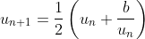

# 0x01. Math - Sequence

## Resources

**Read or watch**:

-   [Introduction to arithmetic sequences](https://intranet.hbtn.io/rltoken/HE3Db5Rs1JDBzcRMBKjGUA "Introduction to arithmetic sequences")
-   [Convergent and divergent sequences](https://intranet.hbtn.io/rltoken/DQqlMOpQXpyYHhgkks_zgg "Convergent and divergent sequences")
-   [Heron of Alexandria](https://intranet.hbtn.io/rltoken/CAVXNxR1bQ86BzNHAOYi5A "Heron of Alexandria ")
-   [Fibonacci Sequence](https://intranet.hbtn.io/rltoken/seeZAle1Wkbx7DTNH3_iag "Fibonacci Sequence")
-   [Mandelbrot Set](https://intranet.hbtn.io/rltoken/DN5HZE5g8C-BzoRyZKlDRQ "Mandelbrot Set")
-   [Julia Set](https://intranet.hbtn.io/rltoken/W070Wc4ukmMceHwpVQ82_A "Julia Set")
-   [PGM format](https://intranet.hbtn.io/rltoken/TZ_KgwpPtOY8vWNm65A0AA "PGM format")
## Learning Objectives

Sequences can be seen in the framework of loops. We can code some of famous sequences such that the Fibonacci’s sequence, Heron’s sequence, etc … We can also see the limit of the sequences and compare them. This point can help in the computation of the complexity of some algorithms.

-   Sequences
-   Arithmetic and Geometric sequences. 3. Recurrent sequences
-   Induction
-   Limits
-   Classic sequences

## Requirements

### C

Before doing this project, you need to know :

-   How to use structures
-   How to use linked lists

### General

-   Allowed editors:  `vi`,  `vim`,  `emacs`
-   All your files will be compiled on Ubuntu 20.04 LTS
-   Your programs and functions will compiled with  `gcc 9.3.0`  using the flags  `-Wall`  `-Werror`  `-Wextra`  `-std=c89`  `and -pedantic`
-   All your files should end with a new line
-   A  `README.md`  file, at the root of the folder of the project
-   There should be no errors and no warnings during compilation
-   Your code should use the  `Betty`  style. It will be checked using  [betty-style.pl](https://github.com/holbertonschool/Betty/blob/master/betty-style.pl "betty-style.pl")  and  [betty-doc.pl](https://github.com/holbertonschool/Betty/blob/master/betty-doc.pl "betty-doc.pl")
## Tasks

### 0. The Heron sequence

mandatory

The Heron sequence is defined by:.

Write a function that return the Heron sequence until having convergence with an error less or equal to  .

-   Prototype:  `t_cell *heron(double p, double x0);`
-   You must use linked lists.


```
julien@ubuntu:~/0x01-math_sequence$ cat 0-main.c
#include <stdio.h>
#include "heron.h"

/**
* main - check the code for Holberton School students.
*
* Return: Always 0.
*/
void print_list(t_cell *head)
{
if (head == NULL)
return;
print_list(head->next);
printf("%lf ",head->elt);
}

int main()
{
double p, u0;
t_cell *head;

u0 = 1;
p = 35;
printf("The Heron sequence until having convergence with an error equal to 10^(-7) is:\n");
head = heron(p, u0);
print_list(head);
printf("\n");
return (0);
}

julien@ubuntu:~/0x01-math_sequence$ gcc -Wall -pedantic -Werror -Wextra -std=c89 0-heron.c 0-main.c -o ./0-heron
julien@ubuntu:~/0x01-math_sequence$ ./0-heron
The Heron sequence until having convergence with an error equal to 10^(-7) is:
1.000000 18.000000 9.972222 6.740986 5.966552 5.916293 5.916080

```

**Repo:**

-   GitHub repository:  `holbertonschool-math`
-   Directory:  `0x01-math_sequence`
-   File:  `0-heron.c`

### 1. The Fibonacci sequence

mandatory

The Fibonacci sequence is defined by:    is valid for    with  .

Code the Fibonacci sequence until having a geometric behavior. How can we deduce the gold number ?

-   Prototypes:  `t_cell *Fibonnaci();`  `double gold_number(t_cell *head);`
-   You must use linked lists.
-   You can use the library  `<math.h>`  in your code


```
julien@ubuntu:~/0x01-math_sequence$ cat 1-main.c
#include <stdio.h>
#include "fibonacci.h"

void print_list(t_cell *head)
{
if (head == NULL)
return;
print_list(head->next);
printf("%d ", head->elt);
}

int main()
{
t_cell *head;

head = Fibonnaci();
print_list(head);
printf("\n");
if (head)
printf("The gold number is: %lf\n", gold_number(head));
return (0);
}

julien@ubuntu:~/0x01-math_sequence$ gcc -std=c89 -Wall -pedantic -Werror -Wextra -lm 1-main.c 1-fibonacci.c -o 1-fibonacci
julien@ubuntu:~/0x01-math_sequence$ ./1-fibonacci
1 1 2 3 5 8 13 21 34 55 89 144 233 377 610 987 1597 2584 4181 6765
The gold number is: 1.618034
julien@ubuntu:~/0x01-math_sequence$

```

**Repo:**

-   GitHub repository:  `holbertonschool-math`
-   Directory:  `0x01-math_sequence`
-   File:  `1-fibonacci.c`

> Written with [StackEdit](https://stackedit.io/).
